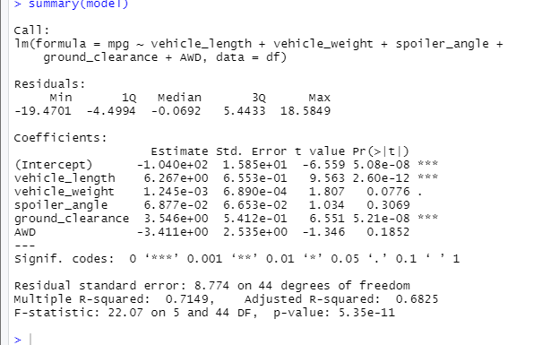
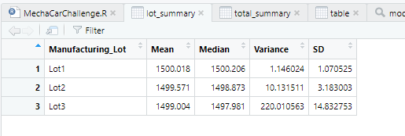
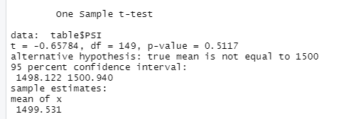

# MechaCar_Statistical_Analysis

## Linear Regression to Predict MPG

Vehicle length and ground clearance provided a non-random amount of variance to the mpg values in the dataset.
Slope is not 0 because we have non-random variance of some variable.
Since r^2 is high, our model is fairly good at predicting MPG.

## Summary Statistics on Suspension Coils

Overall, manufacturing meets design specifications, because our variance of 76psi is less than 100psi.

When grouped by lot, Lots 1 and 2 pass specifications with variances of 1psi and 10psi respectively. However, Lot 3 fails at variance 220psi.

## T-Tests on Suspension Coils

All suspension coil PSI were not statistically different from the population mean. Each individual lot also was not statistically different from population mean.

## Study Design: MechaCar vs Competition
For our Mechacar study we will be studing horsepower and fuel-efficiency.
Our alternative hypothesis is that our cars are statistically better in these fields.
We will run t-tests on these statistics in order to compare against average car competition.
We could either have a full data set and run a two set t test, or if we are only able to get population average, we can run a one sample t test.
